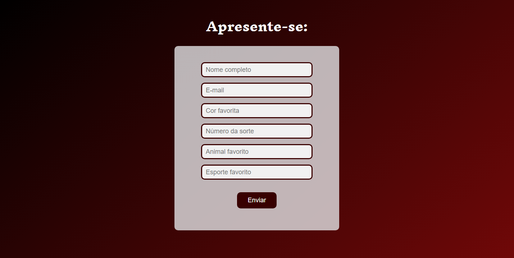

<h1 align="center"> Angular no Banco </h1>

Pequeno formulário integrado ao banco de dados.  

  <a href="#-tecnologias">Tecnologias</a>

 

  

## 🎓 Tecnologias

Esse projeto foi desenvolvido com as seguintes tecnologias:

- Angular
- Node.js
- MySQL
- JavaScript
- Git e Github
- Figma

---

<h4 align="center">By: Isaluh 🤍</h4>
